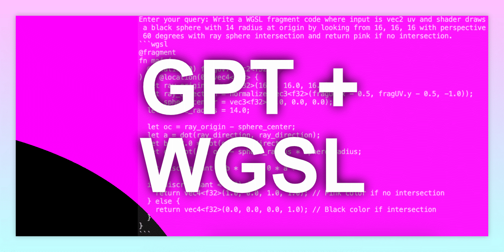

# Make GPT write WGSL GPU Code using Guidance with In-Context Learning

GitHub: https://github.com/mehmetoguzderin/gpt-3.5-turbo-16k-guidance-icl-wgsl

Demo:
````
> python3 gpt-3.5-turbo-16k-guidance-icl-wgsl.py
Enter your query: Write a WGSL fragment code where input is vec2 uv and shader draws a black sphere with 14 radius at origin by looking from 16, 16, 16 with perspective 60 degrees with ray sphere intersection and return pink if no intersection.
```wgsl
@fragment
fn main(
  @location(0) fragUV: vec2<f32>
) -> @location(0) vec4<f32> {
  let ray_origin = vec3<f32>(16.0, 16.0, 16.0);
  let ray_direction = normalize(vec3<f32>(fragUV.x - 0.5, fragUV.y - 0.5, -1.0));
  let sphere_center = vec3<f32>(0.0, 0.0, 0.0);
  let sphere_radius = 14.0;
  
  let oc = ray_origin - sphere_center;
  let a = dot(ray_direction, ray_direction);
  let b = 2.0 * dot(oc, ray_direction);
  let c = dot(oc, oc) - sphere_radius * sphere_radius;
  
  let discriminant = b * b - 4.0 * a * c;
  
  if (discriminant < 0.0) {
    return vec4<f32>(1.0, 0.0, 1.0, 1.0); // Pink color if no intersection
  } else {
    return vec4<f32>(0.0, 0.0, 0.0, 1.0); // Black color if intersection
  }
}
```
````

Due to a popular topic these days, I have received many questions online and directly. They were about whether LLM can support WGSL or whether GPT can write the correct code for a more basic purpose. So, I decided to give it a try and found out that there is a way to guide this model to make fewer mistakes and not use a lot of training credits! In this tutorial, we will use the `guidance` library to interface LLM through In-Context Learning and see how GPT 3.5 16K can generate more grammatically accurate WGSL (WebGPU Shading Language) GPU code.

## Things to Know Before You Start 

It's important to understand that large language models, especially the more sophisticated GPT-4, have certain limitations. For example, you might run into the "hallucination" problem. This means that the model can call non-existing standard library functions. Also, because this model does not have a lot of multimodal training or enforcement, it can result in imperfect outputs or even compile errors. Despite these potential downsides, using GPT in code generation can still be a very useful tool in many situations.

## Prerequisites 

For this tutorial, you must have the following Python libraries installed:

```bash
pip install tiktoken guidance
```

Also, make sure that the `OPENAI_API_KEY` is set in your environment variables.

## Quick Code Overview

We start by importing the required libraries:

```python
from pathlib import Path
import re
import tiktoken
import guidance
import os
import subprocess
```

We specify the language model we're going to use as `llm_string`. In this case, we will use the `"gpt-3.5-turbo-16k"` model. The number of examples is important, and the token size of the example can go up to 1536. Therefore, it is more reliable to use the 16k model than the 4k model to secure enough space to accommodate both the system and response.

```python
llm_string = "gpt-3.5-turbo-16k"
llm_model = guidance.llms.OpenAI(llm_string)
encoding = tiktoken.encoding_for_model(llm_string)
```

We use two popular repositories, `webgpu-samples` and `wgpu`, as sources for examples. This code clones these repositories in the current directory if they don't exist:

```python
repos = ["https://github.com/webgpu/webgpu-samples", "https://github.com/gfx-rs/wgpu"]
for repo in repos:
 repo_name = repo.split("/")[-1].split(".git")[0]
 if not os.path.exists(repo_name):
 print(f"Cloning {repo} into {repo_name}")
 subprocess.run(["git", "clone", "--depth", "1", "--single-branch", repo], check=True)
```

Then we find files with the `.wgsl` suffix from the cloned repositories, remove comments and excessive whitespace, and store the organized code snippets, sorted by their token counts:

```python
suffix = ".wgsl"
path = "./"
cache_file = "cache.md"
cache = ""

if not Path(cache_file).exists():
 wgsl_files = [
 (code, len(encoding.encode(code)))
 for code in [
 re.sub(
 r"^\s*\n",
 "",
 re.sub(r"//.*", "", open(file, "r").read()),
 flags=re.MULTILINE,
 )
 for file in Path(path).rglob(f"*{suffix}")
 ]
 ]
 wgsl_files.sort(key=lambda x: x[1])
```

Then we create a markdown cache file called `cache.md`. This file stores examples of WGSL code. If the cache file doesn't exist, we create it and extend it to make space for the response using smaller code sources first until we reach the token size limit determined by `max_tokens`:

```python
total_tokens = 0
max_tokens = 14200

with open(cache_file, "w") as md_file:
 md_file.write(
 "Use the syntax and style of following WGSL WebGPU Shading Language examples delimited by triple backticks to respond to user inputs.\n\n"
 )
 for code, token_count in wgsl_files:
 if total_tokens + token_count > max_tokens:
 break

 md_file.write("Example WGSL WebGPU Shading Language Code:\n")
 md_file.write("```wgsl\n")
 md_file.write(code.strip() + "\n")
 md_file.write("```\n\n")

 total_tokens += token_count

cache = open(cache_file, "r").read()
```

After that, we create `wgsl_bot`, a `guidance` instance that we will use to generate WGSL code according to the user's query. Note that we set the `temperature` parameter of the model to `0` and `max_tokens` to `1024`. The temperature parameter can significantly affect the output, and once you start exceeding `0.2`, the model sometimes deviates from the grammar of the example.

```python
wgsl_bot = guidance(
 """
{{#system~}}
{{wgsl_cache}}
{{~/system}}

{{#user~}}
Respond to the following question according to the examples:
{{query}}
{{~/user}}

{{#assistant~}}
{{gen 'answer' temperature=0 max_tokens=1024}}
{{~/assistant}}
""",
 llm=llm_model,
)
```

Finally, we take the user query, input it to `wgsl_bot`, and output the generated response (if the user omits the query, we use a simpler query to show the system):

```python
query = input("Enter your query: ")

if not query.strip():
 print("User query is empty. Using default query.\n")
 query = "Write basic pixel code"

print(wgsl_bot(wgsl_cache=cache, query=query)["answer"])
```

That's it, and now you have a GPT instance that can write WGSL GPU code!

If there is incorrect or outdated grammar, you can apply an interesting technique of copying the function name from `cache.md` and asking GPT to write that function with specific behavior. For example, a request like "Write fmain in monochrome". This will get you a more appropriate response.

In the future, benchmarking in-context learning with various examples will be an interesting challenge. In this tutorial, we used shaders from `webgpu-samples` and `wgpu`, but using more diverse and shorter codes will definitely improve performance.

By the way, since I did not have access to GPT4, this was tested only with GPT3. Also, OpenAI is developing fine-tuning for new models, so I avoided fine-tuning and sharing the old models that are no longer in use.

Happy coding!

Special thanks to Kim Miryeong and Shim Hanna for helping me write this article. Also, special thanks to emadurandal_cgj, cx20, and CTsuchinoko for the discussion that pursued this idea and held a great online meeting!

Complete Code:

```python
from pathlib import Path
import re
import tiktoken
import guidance
import os
import subprocess

llm_string = "gpt-3.5-turbo-16k"
llm_model = guidance.llms.OpenAI(
    llm_string
)  # Make sure OPENAI_API_KEY is set in your environment variables
encoding = tiktoken.encoding_for_model(llm_string)

repos = ["https://github.com/webgpu/webgpu-samples", "https://github.com/gfx-rs/wgpu"]

for repo in repos:
    repo_name = repo.split("/")[-1].split(".git")[0]
    if not os.path.exists(repo_name):
        print(f"Cloning {repo} into {repo_name}")
        subprocess.run(
            ["git", "clone", "--depth", "1", "--single-branch", repo], check=True
        )

suffix = ".wgsl"
path = "./"
cache_file = "cache.md"
cache = ""

if not Path(cache_file).exists():
    wgsl_files = [
        (code, len(encoding.encode(code)))
        for code in [
            re.sub(
                r"^\s*\n",
                "",
                re.sub(r"//.*", "", open(file, "r").read()),
                flags=re.MULTILINE,
            )
            for file in Path(path).rglob(f"*{suffix}")
        ]
    ]
    wgsl_files.sort(key=lambda x: x[1])

    total_tokens = 0
    max_tokens = 14200

    with open(cache_file, "w") as md_file:
        md_file.write(
            "Use the syntax and style of following WGSL WebGPU Shading Language examples delimited by triple backticks to respond to user inputs.\n\n"
        )
        for code, token_count in wgsl_files:
            if total_tokens + token_count > max_tokens:
                break

            md_file.write("Example WGSL WebGPU Shading Language Code:\n")
            md_file.write("```wgsl\n")
            md_file.write(code.strip() + "\n")
            md_file.write("```\n\n")

            total_tokens += token_count

cache = open(cache_file, "r").read()


wgsl_bot = guidance(
    """
{{#system~}}
{{wgsl_cache}}
{{~/system}}

{{#user~}}
Respond to the following question according to the examples:
{{query}}
{{~/user}}

{{#assistant~}}
{{gen 'answer' temperature=0 max_tokens=1024}}
{{~/assistant}}
""",
    llm=llm_model,
)

query = input("Enter your query: ")

if not query.strip():
    print("User query is empty. Using default query.\n")
    query = "Write basic pixel code"

print(wgsl_bot(wgsl_cache=cache, query=query)["answer"])
```
